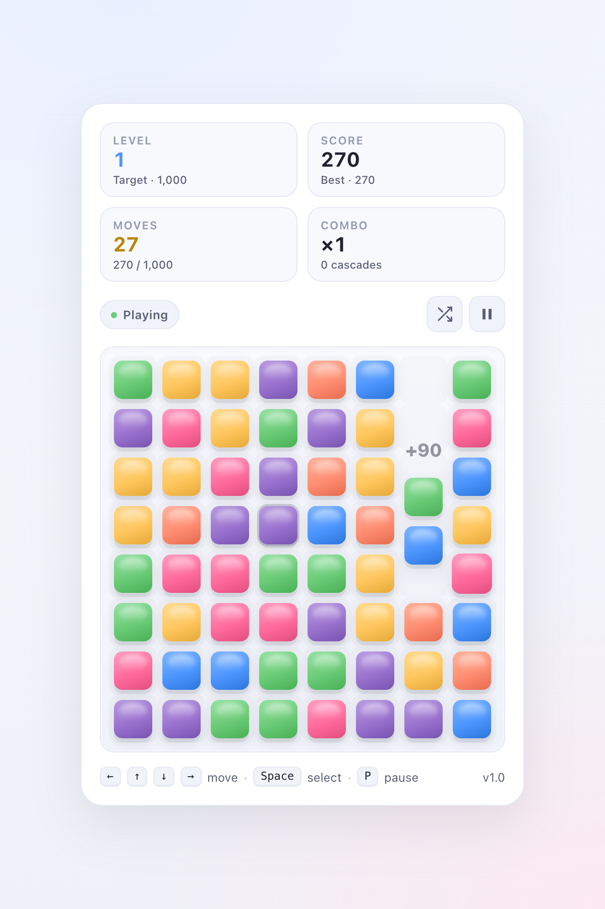

# Gems — A Match-3

A clean, modern browser match-3 game. React + Vite + TypeScript.



## Quick start

```sh
npm install
npm run dev          # http://localhost:5173
```

Other scripts:

```sh
npm run build        # production build → dist/
npm run preview      # serve the production build
npm run test         # vitest run
npm run test:watch   # vitest in watch mode
npm run test:coverage
npm run typecheck    # tsc -b --noEmit
npm run lint         # eslint
npm run lint:fix     # eslint --fix
npm run format       # prettier --write .
```

Node 20.19+ is required (Vite 8's minimum).

## How to play

- **Mouse / touch** — click a gem to select, click an adjacent gem to swap, click the same gem again to deselect.
- **Keyboard** — arrow keys to move, Space / Enter to select / swap, P or Esc to pause, R to restart the level.

The game hits the target score → level complete. Out of moves → game over. Difficulty ramps each level (higher targets, fewer moves, more colors).

See [`docs/game-rules.md`](docs/game-rules.md) for the full mechanics.

## Project layout

```
src/
├── game/          Pure game logic (engine, board, types, config, storage)
├── components/    React view components (Board, Gem, HUD, Overlays, …)
├── hooks/         React glue (useGame, useKeyboardInput, useVisibilityPause)
├── App.tsx        Top-level layout
├── main.tsx       React entry point
└── index.css, App.css

docs/              Architecture, plan, game rules, migration notes
legacy/            The original v1 single-file game, preserved for reference
```

See [`docs/architecture.md`](docs/architecture.md) for the design and the engine ↔ React contract.

## Tooling

| Tool | Version | What |
| --- | --- | --- |
| React | 19.2 | UI library |
| Vite | 8.1 | Bundler / dev server |
| TypeScript | 7.0 | Types |
| Vitest | 4.1 | Test runner |
| Biome | 2.5 | Linter + formatter (single Rust tool, ~100x faster than ESLint + Prettier) |
| jsdom | 30 | Test environment |

## Features

- 8×8 grid, 6→7→8 gem colors as you progress through levels
- Smooth swap / fall / pop animations
- Cascading matches with combo multiplier
- Special pieces: 4-in-a-row → striped (clears a row or column), 5+ in a row → color bomb (swap with any gem to clear all of that color, or two bombs to wipe the board)
- 5-second inactivity hint, then a 3-second pulse on a valid move
- Auto-shuffle when no moves are possible
- Increasing difficulty per level (higher targets, fewer moves, more colors)
- High score saved in `localStorage` (key: `gems.match3.v1`)
- Start, pause, level-complete, and game-over screens
- Auto-pause when the tab is hidden
- Mouse / touch and full keyboard support
